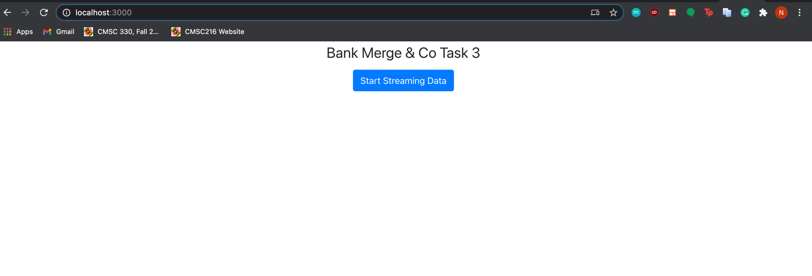
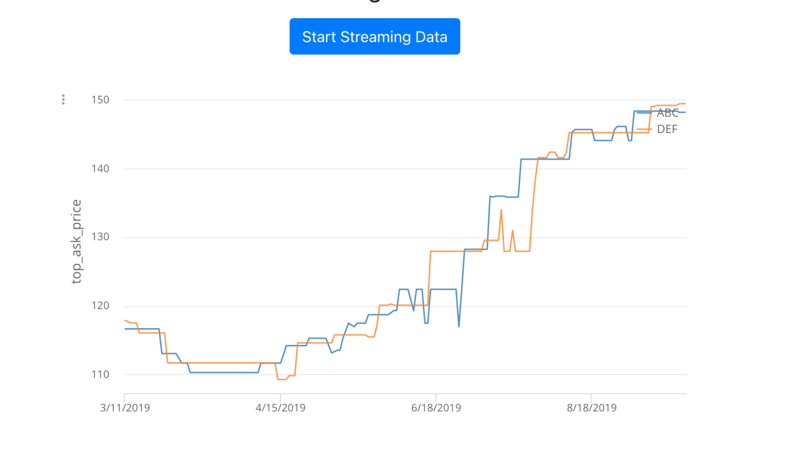
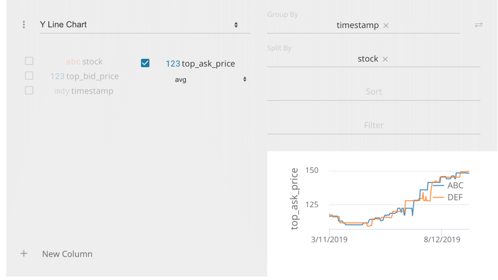
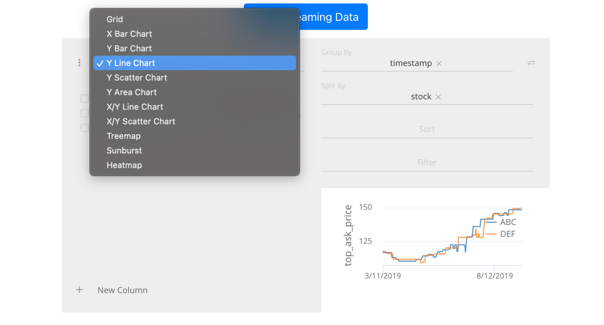
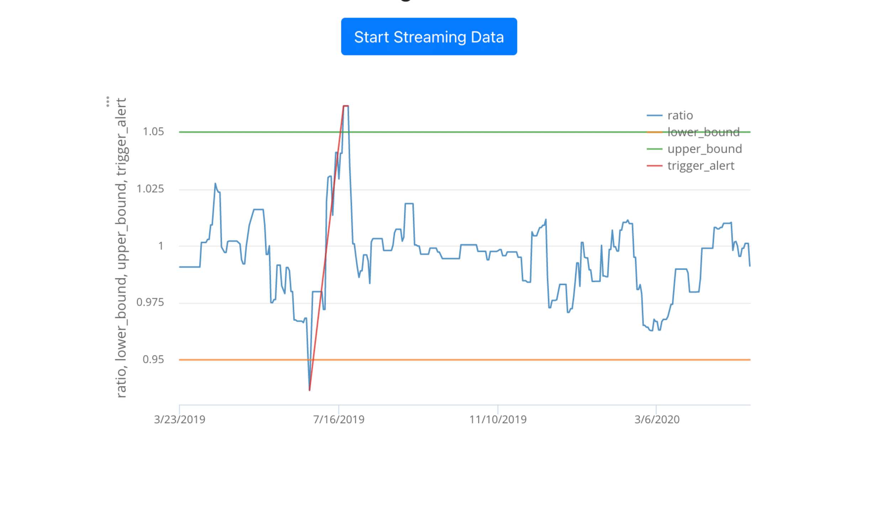
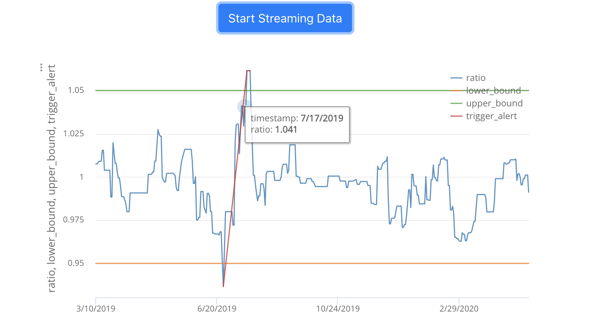
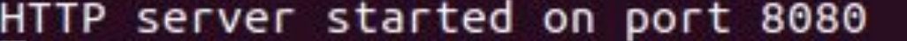

# Data Feed Visual of Stocks
This project allows you to both visualize and analyze share price data of different stocks.

## Overview
This project utilizes JP Morgan's Perspective Visualization open source code to generate a chart that displays the data feed in a clear and visually appealing manner for traders to monitor this trading strategy.
Features:
- Track and display the ratio between the two stock prices.
- Show the historical upper and lower bounds of the stocks' ratio.
- Show 'alerts'  whenever these bounds are crossed by the ratio, which a trader can use to determine to sell a stock if it is increasing in price or to buy a stock if the prices are lower than normal.
- Trigger 'alerts' on the graph whenever the bounds are crossed by the calculated ratio in a specific time period

## Demo
Running the server and client scripts in two separate terminals will show an live feed of stock data such as the Name of the stock, and bidding/asking prices.

Activating the datafeed in the Server will open up JP Morgan Chase's Perspective open source code in a browser for data visualization.

Once you being to Start Streaming Data, the data feed will start to show the price fluctuations of two different stocks, one stock being the orange line and the other stock being the blue line. This provides the trader with visuals that will allow him/her to compare and correlate competing stocks.

A feature of the live data feed is to change the format that the information is displayed as. Options include a Bar Chart, Line Chart, Scatter Chart, and more as shown below. 

This graph us a more useful tool a trader can use where the feed tracks the RATIO between two stocks over time instead of the stock's asking prices. By manipulating the stock data in this way, upper and lower threshold/bounds are set to help a person determine a treading opportunity. 

The red line in the graph that connects the peak ratio and lowest ratio in the graph serves as a trigger alert to the trader that notifies them of when a threshold is passed by the ratio of the two stocks.

You have the option of hovering over the ratio line in the graph to display the timestamp and ratio of that point you choose. 

## How to Run
- Clone this repository via command: "git clone https://github.com/insidesherpa/JPMC-tech-task-1-py3.git" 
- Go into the directory that all the files are in.
- Run the command: "python3 datafeed/server3.py"
- If done right, should show 
- In a separate terminal, run "npm install" && "npm start" to start the React application
- Open http://localhost:3000 to view the app in the browser. The page will reload if you make edits.
If you are using Windows, make sure to run your terminal/command prompt as administrator.
- Click on "Start Streaming Data" button on brower to start live data feed. 
- Can click on three dotted icon on top left of graph to mess around with different features.

## System Requirements
- [Python 3]("https://realpython.com/installing-python/") installed
- [Git]("https://www.atlassian.com/git/tutorials/install-git#mac-os-x") installed
- [NVM]("https://github.com/nvm-sh/nvm#install--update-script") Installed
- Have [Xcode]("https://developer.apple.com/xcode/") installed (If Mac User)
- Have [pip]("https://pip.pypa.io/en/stable/installing/#installing-with-get-pip-py") Installed

